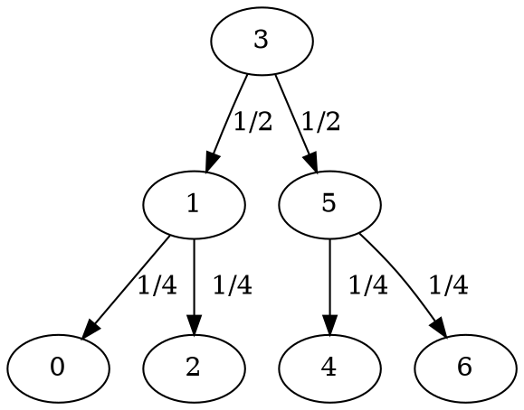

# Raport do zadania `binsearch`

### Autor: Wiktoria Kuna
### Numer indeksu: 316418

Konfiguracja
---

Informacje o systemie:

 * Dystrybucja: Pop!_OS 19.10
 * Jądro systemu: Linux 5.3.0-7648-generic
 * Kompilator: GCC 9.2.1
 * Procesor: Intel(R) Core(TM) i7-8750H CPU @ 2.20GHz
 * Liczba rdzeni: 6

Pamięć podręczna:

 * L1d: 32 KiB, 8-drożny (per rdzeń), rozmiar linii 64B
 * L2: 256 KiB, 4-drożny (per rdzeń), rozmiar linii 64B
 * L3: 9 MiB , 12-drożny (współdzielony), rozmiar linii 64B

Pamięć TLB:

 * L1d: 4KiB strony, 4-drożny, 64 wpisy
 * L2: 4KiB + 2MiB strony, 12-drożny, 1536 wpisów

Informacje o pamięciach podręcznych uzyskano na podstawie wydruku programu
`lscpu` oraz [wikichip](https://en.wikichip.org/wiki/intel/microarchitectures/coffee_lake).

Wyniki eksperymentów
---

Doświadczenia były wykonywane według szablonu:
```
./binsearch -S 0x5bab3de5da7882ff -n {0-27} -p {}  -t {10,15,25} -v {0,1}
```

### Ogólne porównanie

***Tabela 1*** Porównanie uśrednionych wartości wybranych współczynników
                dla `binsearch0` i `binsearch1`.
|                       | `binsearch0` | `binsearch1` |
|:---------------------:|:------------:|:------------:|
|     Średnie `IPC`     |    0.997     |    0.818     |
| Branch missprediction |    4.48%     |    3.87%     |
|     L1 miss ratio     |    33.26%    |    3.87%     |
|     L2 miss ratio     |    82.21%    |    28.66%    |
|     L3 miss ratio     |    28.36%    |    10.76%    |
|    TLB miss ratio     |    3.06%     |    3.87%     |


#### Czas wykonania programów
***Wykres 1*** Czas wykonania w zależności od wielkości tablicy (dla t = 25).


### Badanie wpływu kolejności instrukcji w pętli na IPC zoptymalizowanej funkcji
Kod po optymalizacji ma następującą postać:
```C=
bool binsearch1(T *arr, long size, T x){
  long i = 0;
  
  while(i < size){
    T y = arr[i];
    if (x==y)
      return true;
    i <<= 1;
    i += (x > y) + 1;
  }
  return false;
}
```

Przeprowadzone zamiany:
- $(1)$ Przeniesienie warunku na koniec pętli. 
```C=
  while(i < size){
    T y = arr[i];
    i <<= 1;
    i += (x > y) + 1;
    if (x==y)
      return true;
  }
```
- $(2)$ Przeniesienie 8 linijki przed warunek.
```C=
  while(i < size){
    T y = arr[i];
    i <<= 1;
    if (x==y)
      return true;
    i += (x > y) + 1;
  }
```

Porównanie wyników wywołania programu:
```
./binsearch -S 0x5bab3de5da7882ff -n {0-27} -p ipc -t {5,15,25} -v 1
```

| Zmiana | Średnie `IPC` |
|:------:|:-------------:|
| $(0)$  |     0.685     |
| $(1)$  |     0.601     |
| $(2)$  |     0.666     |


### Wybundowana instrukcja kompilatora a działanie programu

Kod po użyciu instrukcji `__builtin_prefetch`:
```C=
bool binsearch1(T *arr, long size, T x)
{
  long i = 0;
  while(i < size)
  {
    T y = arr[i];
    __builtin_prefetch(&arr[(i<<2) + 1]);
    __builtin_prefetch(&arr[(i<<2) + 2]);
    
    if (x==y)
      return true;

    i <<= 1;
    i += (x > y) + 1;
  }
  return false;
}
```

|        Zmiana         | binsearch1 przed | binsearch1 po |
|:---------------------:|:----------------:|:-------------:|
|     Średnie `IPC`     |      0.818       |     1.153     |
| Branch missprediction |      3.87%       |     4.50%     |
|     L1 miss ratio     |      3.87%       |     9.97%     |
|     L2 miss ratio     |      28.66%      |    19.17%     |
|     L3 miss ratio     |      10.76%      |     6.40%     |
|    TLB miss ratio     |      3.87%       |     3.52%     |

***Wykres 2*** Czas wykonania w zależności od wielkości tablicy (dla t = 25) i z użyciem `__builtin_prefetch`.


Wnioski
---

### Czemu organizacja danych spowodowała przyspieszenie algorytmu? Jak zmieniła się lokalność czasowa elementów przechowywanych w pamięci podręcznej?
Główny problem ze standardową implementacją algorytmu binary search, tak jak w przypadku `binsearch0` jest robienie dostępów do elementów tablicy często bardzo odległych od siebie, a co za tym idzie - częściej wymagających załadowania z niższych poziomów pamięci (co potrafi być bardzo kosztowne).

Zreorganizowanie ułożenia danych za pomocą funkcji `linearize` i zamiana posortowanej tablicy na ustawione po sobie węzły drzewa przeszukiwań (zaczynając od lewej i wpisując wszystkie węzły z danego poziomu drzewa) zaskutkowało większą lokalnością dla `binsearch1`.

Poniższe przykładowe drzewo (utworzone z danej posortowanej tablicy) pokazuje prawdopodobieństwo trafienia w dany węzeł drzewa podczas przeszukiwania binarnego:



Dla wierzchołka na poziomie n, prawdopodobieństwo na jego trafienie wynosi $\frac{1}{2^n}$. Stąd wynika decyzja o wyżej wspomnianym ułożeniu elementów w tablicy. Tutaj także widoczna jest różnica w lokalności czasowej między `binsearch0` a `binsearch1`. Dla drugiej z nich istnieje większe prawdopodobieństwo, że bloki najczęściej używane nie będą często wymieniane.

### W jaki sposób zmiana kolejności instrukcji w ciele pętli zmienia IPC?

Dla przeprowadzonych permutacji instrukcji obserwujemy spadek IPC o około $11\%$.

[Wydruki llvm-mca](https://hackmd.io/zO1_ANjuRwqtVZSeiA4lVw) dla 100000 iteracji każdej z funkcji.

Z wydruków możemy odczytać sprzeczny stosunek `IPC` dla poszczególnych zmian niż ten uzyskany z doświadczeń. 

Funkcja po przekształceniu $(1)$ ma najwyższe `IPC`, `Block RThroughput` (teoretyczna ilość maksymalnej ilości bloków kodu (np. iteracji) możliwa do przetworzenia w zasymulowanym cyklu zegarowym), jednakże cechuje się wysokimi (w stosunku do pozostałych) współczynnikami `resource pressure per iteration` - czyli ilością cykli potrzebną na przetworzenie danego typu instrukcji, jak również i średnio większą `resource pressure per instruction` - czyli ilością cykli potrzebną na wykonanie danej instrukcji.

Zatem wysokie współczynniki w przypadku przekształcenia $(1)$ świadczą o jakichś fizycznych ograniczeniach maszyny do przetwarzania danego typu instrukcji jednocześnie - lepsze rozdystrybuowanie ich w przypadku $(0)$ skutkuje lepszą wydajnością (dodając ewentualne błędy pomiarowe i zdecydowanie większą ilość iteracji). 

### Czy  użycie  instrukcji  wbudowanych  kompilatora «__builtin_expect» i «__builtin_prefetch» przynosi jakieś zyski?

`__builtin_expect(long exp, long c)` - można użyć tej instrukcji, aby przekazać kompilatorowi informację o przewidywanym skoku. Zwraca `exp`.

`__builtin_prefetch (const void *addr, ...)` - służy do zmniejszenia chybień w pamięć podręczną poprzez danie sygnału, że dany blok pamięci będzie wkrótce potrzebny i można go załadować przed wydaniem instrukcji do jego dostępu.
[Źródło: Dokumentacja GCC](https://gcc.gnu.org/onlinedocs/gcc/Other-Builtins.html)

Nie zauważyłam poprawy używając `__builtin_expect`, natomiast znacznie zmieniła się wydajność mojego programu z użyciem `__builtin_prefetch`. Ze względu na wcześniejsze ściągnięcie do pamięci dwóch hipotetycznie potrzebnych wartości (jedna z nich była na pewno potrzebna) znacznie spadło miss ratio tak jak i czas wykonania programu. Zwiększyło to także `IPC` mojej funkcji, na tyle by było ono większe od `IPC` dla `binsearch0`.

###### tags: `ask`