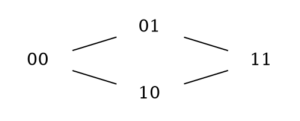
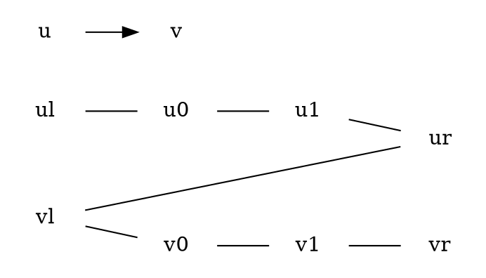

# Lista 14

|  1  |  2  |  3  |  4  |  5  |  6  |  7  |  8  |  9  | 10  |
|:---:|:---:|:---:|:---:|:---:|:---:|:---:|:---:|:---:|:---:|
|  X  |  X  |  X  |  X  |     |  X  |  X  |  X  |  X  |  X  |

| 11  | 12  | 13  | 14  | 15  | 16  | 17  | 18  |
|:---:|:---:|:---:|:---:|:---:|:---:|:---:|:---:|
|  X  |  X  |  X  |  X  |  X  |  X  |  X  |  X  |

## Zadanie 1

Co można powiedzieć o macierzy sąsiedstwa grafu $G$ i macierzy sąsiedztwa jego dopełnienia $\stackrel{-}{G}$?

Dla macierzy sąsiedztwa $Q$ grafu pełnego o takiej samej ilości wierzchołków co $G$, $Q-G$ da macierz sąsiedztwa dopełnienia grafu $G$. O ile nie dopuszczamy krawędzi wielokrotnych.

Jeśli $I_i$ jest wektorem jednostkowym, który na pozycji $i$-tej ma jedynkę a na pozostałych zero, to $AI$ jest wektorem krawędzi wchodzących do $v_i$.

$A^2I_i$ natomiast, jest wektorem przedstawiającym liczbę różnych dróg długości $2$ prowadzących do wierzchołka $v_i$.

## Zadanie 2

Zauważmy, że $G$ jest $k$-regularny.

Dowód: indukcja po $k$.

$1^\circ$ $k = 2$ Zachodzi.

$2^\circ$ Załóżmy, że teza zachodzi dla $t < k$.

Weźmy dowolne dwa wierzchołki w $Q^k$ -- $x,y$. 
Rozpatrzmy przypadki:

Załóżmy, że $j$-ty koordynat w $x$ i $y$ jest taki sam. Niech $Q$ będzie taką kopią $Q_{k-1}$ w $Q_k$, że jego wierzchołki mają taką samą wartość w $j$-tym koordynacie. A $Q'$ będzie pozostałą kopią $Q_{k-1}$.
Z założenia indukcyjnego $Q$ zawiera $k-1$ rozłącznych dróg. niech $x'$ i $y'$ będą sąsiadami w $x,y$ w $Q'$. Łącząc ścieżkę $x',y'$ w $Q'$ z krawędziami $xx'$ i $yy'$ otrzymujemy $k$-tą, rozłączną od pozostałych, drogę (nie przechodzi przez wierzchołki w $Q$).

Załóżmy, że $x,y$ różnią się na każdym koordynacie. Wtedy możemy wyznaczyć drogi: $j$-ta droga zaczyna się w $x$ zmieniając $j$-ty koordynat w $x$, potem $j+1$-szy, $j+2$-gi itd... (cyklicznie). Po $k$ krokach droga zakończy się w $y$. Wierzchołki $j$-tej drogi zgadzają się z $y$ podciągiem zaczynającym się od $j$-tego koordynatu, a z $x$ podciągiem kończącego się na $j-1$ koordynacie. Zatem żadne drogi nie współdzielą wierzchołków.

## Zadanie 3

$(a)$ graf $M_k$ nie ma trójkątów.

$1^\circ$ $k = 2 < 3$ $\checkmark$ 
$2^\circ$ Załóżmy, że $M_{k-1}$ nie posiada trójkątów.

Załóżmy nie wprost, że $M_k$ (skonstruuowany z $M_{k-1}$) posiada jakiś trójkąt, a $v'$ jest jednym z wierzchołków tego trójkąta (jeśli by nie był to by znaczyło, że $M_{k-1}$ również zawiera trójkąt). Wierzchołek $v'$ sąsiaduje z $N(v)$. Zatem musi istnieć jakaś krawędź $v_iv_j$ tworząca trójkąt z $v'$. Ale to znaczyłoby, że w grafie $M_{k-1}$ istnieje trójkąt $vv_iv_j$, sprzeczność.

$(b)$ graf $M_k$ jest $k$-kolorowalny.

$1^\circ$ $k = 2$ $\checkmark$ 
$2^\circ$ Załóżmy, że $M_{k-1}$ jest $k-1$-kolorowalny.
Niech $c_{M_{k-1}}$ będzie $k-1$-kolorowaniem grafu $M_{k-1}$. Możemy zdefiniować kolorowanie $c_{M_k}$ jako rozszerzenie $c_{M_{k-1}}$.
Niech dla każdego dodanego wierzchołka $v_i'$ zachodzi $c_{M_{k-1}} (v_i) = c_{M_k}(v_i')$ (wierzchołki nie łączy krawędź, stąd kolorowanie wciąż jest poprawne), a wierzchołek $w$ pokolorujmy nowym kolorem $c_k$. Zatem $M_k$ jest $k$-kolorowalny.

$(c)$ graf $M_k$ nie jest $k-1$-kolorowalny.

$1^\circ$ $k = 2$ $\checkmark$ 

$2^\circ$ Załóżmy, że $M_{k-1}$ nie jest $k-2$-kolorowalny.

Załóżmy nie wprost, że $M_k$ jest $k-1$ kolorowalny (w tym jego podgraf $M_{k-1}$). Weźmy to kolorowanie i pokażmy, że możemy pokolorować $M_{k-1}$ na $k-2$ kolory.

Bez straty ogólności załóżmy, że kolor wierzchołka $w$ to $c_{k-1}$. Wtedy wierzchołki $v_i'$ mogą przyjąć kolory $c_1,c_2,...,c_{k-2}$.

Weźmy $A$ - zbiór wierzchołków $v_i$, które mają kolor $c_{k-1}$. Każdemu takiemu wierzchołkowi możemy zmienić kolor na kolor $v_i'$ zachowując poprawne kolorowanie, bo skoro $v_i$ są tego samego koloru to nie mogą ze sobą sąsiadować; Z kolei wierzchołki $v_i$ oraz $v_i'$ mają wspólnych sąsiadów, ale nie istnieje krawędź między nimi. 

W ten sposób kolor $k-1$ w grafie $M_{k-1}$ nie jest już używany, co oznacza, że można pokolorować go na $k-2$ kolory. Sprzeczność.

## Zadanie 4 

Z twierdzenia Diraca graf $G$ zawiera cykl Hamiltona. Weżmy zatem cykl Hamiltona zaczynający się w wierzchołku $v_0$. Do skojarzenia $M$ dodawajmy krawędzie wychodzące z wierzchołka o indeksie nieparzystym, czyli $v_1 - v_2$, $v_3 - v_4$, ..., $v_{2n-1} - v_{0}$. Jest to doskonałe skojarzenie $G$.

## Zadanie 6

Szukamy zatem warunku koniecznego i dostatecznego na istnienie skojarzenia o mocy $k$ w grafie dwudzielnym $G = (C \cup D, E)$ . Niech $D$ to zbiór dziewcząt, a $C$ -- chłopców.

Poszerzmy więc zbiór $C$ o $C'$ -- $n-k$ wierzchołków połączonych z każdym wierzchołkiem z $D$. Nazwijmy tak utworzony graf $G'$.

Tw. W $G$ istnieje skojarzenie o mocy $k$ $\iff$ w $G'$ istnieje skojarzenie o mocy $n$. 

$\implies$

Jeśli w $G$ istnieje skojarzenie o mocy $k$ to możemy wybrać takie wierzchołki ze zbioru $D$, które nie zostały jeszcze pokryte żadnymi krawędziami ze skojarzenia. Jest ich dokładnie $n-k$. Skoro w zbiorze $C'$ mamy dokładnie $n-k$ wierzchołków, każdy z nich połączony z każdym wcześniej wymienionym wierzchołkiem z $D$, to możemy uzyskać w $G'$ skojarzenie łącząc każdy niepokryty wierzchołek z $D$ z jednym dowolnym wierzchołkiem z $C'$. Tak otrzymamy skojarzenie o mocy $n$.

$\impliedby$

Jeśli w grafie $G'$ istnieje skojarzenie o mocy $n$ to co najwyżej $n-k$ krawędzi tego skojarzenia jest incydentna do wierzchołków z $C'$. W takim razie, w grafie $G$ istnieje skojarzenie o mocy co najmniej $k$.

Z tw. Halla, skojarzenie mocy $|D|$ istnieje $\iff$ dla każdego $X \subseteq D: |N_{G'}(X)| \geq |X|$

$$
|X| \leq |N_{G'}(X)| = |N_{G'}(X) \cap C| + |N_{G'}(X) \cap C'| = |N_G(X)| + n -k \iff N_G(X) \geq |X| + k - n
$$

## Zadanie 7

Niech $G = (D \cup C, E)$ graf dwudzielny, w którym $|D| = n$.

Utwórzmy graf $G'= (D \cup C', E')$ w taki sposób, aby każdy wierzchołek z $c$ sklonować $3$ razy (żeby łącznie było ich po 4). Natomiast każda krawędź incydentna do wierzchołka $c_i$ w $C$, będzie incydentna do dokładnie jednego wierzchołka $c_{i,j}$ ($1 \leq j \leq 4$).

W $G'$ istnieje skojarzenie mocy $k$ $\iff$ w $G$ istnieje $k$ małżeństw, takich że każda kobieta ma jednego męża, a mężczyzna co najwyżej $4$ żony.

$\implies$
Jeśli istnieje skojarzenie o mocy $k$ w $G'$ oznacza to, że dokładnie $k$ wierzchołków z $D$ jest pokryte, a po suma krawędzi incydentnych do $c_{i,1} ... c_{i,4}$ (czyli wierzchołka w $G$) nie przekracza $4$.

$\impliedby$
Analogicznie, jeśli istnieje $k$ takich małżeństw to do każdego wierzchołka $c_i$ incydentnych jest co najwyżej $4$, a do $d_i$ co najwyżej jedna. Stąd po rozdzieleniu wierzchołka $c_i$ otrzymamy $G'$ ze skojarzeniem o mocy $k$.

Korzystając z tw. Halla, w $G'$ będzie istnieć skojarzenie o mocy $n$ $\iff$ każdy z $k$ wierzchołków w $D$ ma co najmniej $k$ sąsiadów. Oznacza to, że w grafie $G$ każdy wierzchołek z $D$ musi mieć przynajmniej $\frac{k}{4}$ sąsiadów (znać chłopców).

## Zadanie 8

Weźmy drzewo $T$ i jego doskonałe skojarzenie $M$.
Załóżmy nie wprost, że istnieje doskonałe skojarzenie $M'$, takie że $M \neq M'$.

Utwórzmy graf $G$ o wierzchołkach $T$ i krawędziach z różnicy symetrycznej $M$ i $M'$. Musi być to podgraf $T$. Zauważmy, że jeśli krawędź $e$ (z $v$ do $v'$) należy jednocześnie do $M$ i $M'$ to wierzchołki incydentne do krawędzi $e$ będą stopnia zerowego. Jeśli $e$ należy tylko do jednego skojarzenia, to istnieją krawędzie: $e'$ incydentna do $v$ i $e"$ incydentna do $v'$ w drugim skojarzeniu. Wtedy wierzchołki $v$ i $v'$ będą miały stopień dwa w grafie $G$.

Usuńmy teraz wszystkie wierzchołki stopnia zerowego z grafu $G$ i nazwijmy ten graf $G'$.

Jeśli $G'$ jest pusty to oznacza to, że $M = M'$, sprzeczność.

Wpp. wszystkie wierzchołki w tym grafie są stopnia dwa. Zatem w $G'$ istnieje cykl. Ale $G'$ jest podgrafem $T$. Sprzeczność.

## Zadanie 9

Zauważmy, że ponieważ graf $G$ jest dwudzielny, więc jego pełne skojarzenie będzie miało długość $n$. Zauważmy, że ciąg $a_{i, \sigma(i)}$ dla każdego dokładnie wierzchołka z $V_1$ sprawdza czy istnieje krawędź do dokładnie jednego wierzchołka z $V_2$. W ten sposób nigdy nie zostanie utworzone zapytanie o jednocześnie np. $a_{i,j}$ i $a_{i,k}$ lub $a_{i,j}$ i $a_{k,j}$. Zawsze sprawdza zatem taki zbiór $n$ krawędzi, że żadna z tych krawędzi nie ma wspólnego wierzchołka. 

Jeśli w takim zbiorze wszystkie połączenia istnieją -- w grafie $G$ jest to doskonałe skojarzenie, a zatem iloczyn współszynników $a_{i, \sigma(i)}$ jest równy jeden, wpp. zero. 

Ponadto, zawsze sprawdzamy połączenia z $V_1$ do $V_2$, przez co żadna permutacja zbioru rozłącznych krawędzi się nie powtórzy.

Watość parametru $perm(A)$ jest zatem liczba wszystkich doskonałych skojarzeń w $G$.

## Zadanie 10

Niech $G$ -- $d$-regularny graf dwudzielny składa się z rozłącznych zbiorów wierzchołków $X$ i $Y$ oraz krawędzi między nimi.

$1.$ $|Y| = |X|$

Wynika z regularności $G$. Z $X$ wychodzi dokładnie $d |X|$ krawędzi i do $Y$ wchodzi dokładnie $d |X|$ krawędzi. Analogicznie z $Y$ wychodzi $d|Y|$ krawędzi. Stąd $d|X| = d|Y| \iff |X| = |Y|$.

$2.$ $G$ posiada pełne skojarzenie.

Weźmy (bez straty ogólności) $S \subseteq X$. Zauważmy, że liczba krawędzi między $S$ a $N(S)$ to dokładnie $d|S|$. Z drugiej strony, liczba krawędzi wchodzących do $N(S)$ to $d|N(S)|$, wśród nich znajdują się krawędzie wychodzące z podzbioru $S$. Zatem $d|S| \leq d |N(S)| \iff |S| \leq |N(S)|$. Na mocy twierdzenia Halla, w grafie $G$ istnieje doskonałe skojarzenie.

## Zadanie 11

Niech $G$ -- $3$-regularny graf Hamiltona.

Korzystając z lematu o uściskach dłoni wiemy, że $G$ musi mieć parzystą liczbę wierzchołków $(2m = 3n)$. Zatem cykl Hamiltona w tym grafie musi być parzystej długości. Weźmy ten cykl Hamiltona i pokolorujmy jego krawędzie naprzemian kolorami $c_1$ i $c_2$. Pozostałe krawędzie tworzą doskonałe skojarzenie (każdy wierzchołek w tym grafie ma stopień $3$, a każdy jest incydentny do dwóch krawędzi z cyklu Hamiltona), pokolorujmy je kolorem $c_3$. Wtedy każdy wierzchołek będzie incydentny do dokładnie jednej krawędź każdego z kolorów. 

## Zadanie 12

$(a)$ $deg(v) \neq d \implies deg(v) < d$

Skoro $\chi'(G) = d$ to weźmy optymalne kolorowanie i rozważmy krawędzie incydentne do $v$. Skoro $deg(v) < d$ to istnieje kolor $c_1$ taki, że żadna krawędź incydentna do $v$ nie ma tego koloru. Krawędzie koloru $c_1$ po usunięciu wierzchołka $v$ w grafie $G'$ utworzą doskonałe skojarzenie. W szczególności, liczba wierzchołków w $G'$ musi być parzysta.

Załóżmy nie wprost, że $deg(v) > 0$ i rozważmy krawędź koloru $c_2$ incydentną do $v$. Krawędzie koloru $c_2$ tworzą skojarzenie doskonałe w $G$, tzn. $G$ ma parzystą liczbę wierzchołków. Sprzeczność. Zatem $deg(v) = 0$.

$(b)$ 
Załóżmy nie wprost, że $\chi'(G) = d$. Wtedy dla ustalonego $d$-optymalnego kolorowania krawędzie dowolnego koloru tworzą skojarzenie doskonałe. 
Niech $v$ -- wierzchołek rozcinający. Niech $v$ łączy dwie spójne składowe (które powstałyby w grafie $G$ po jego usunięciu) $H_1,H_2$, takie, że nie ma krawędzi między $H_1$ a $H_2$. 

Weźmy krawędź koloru $c_k$ łączącą wierzchołek $v$ z wierzchołkiem w $H_1$. Skoro krawędzie $c_k$ tworzą doskonałe skojarzenie, to liczba wierzchołków w $H_1$ musi być nieparzysta, natomiast liczba wierzchołków w $H_2$ -- parzysta.

Analogicznie, weźmy krawędź koloru $c_t$, która łączy wierzchołek $v$ z wierzchołkiem w $H_2$. Skoro krawędzie o kolorze $c_t$ tworzą doskonałe skojarzenie to $H_2$ zawiera nieparzystą liczbę wierzchołków, a $H_1$ -- parzystą. Sprzeczność. 

Skoro $\chi'(G) \leq d+1$ to $\chi'(G) = d+1$.

## Zadanie 13

Nazwijmy wierzchołki w $K_{n}$ (gdzie $n$ jest nieparzyste) jako $v_0, v_1, ..., v_{n-1}$

Teraz pokolorujmy każdą krawędź $\{v_i, v_j\} = \{v_j, v_i\}$ kolorem $i+j \pmod{n}$. Pokażmy, że żaden wierzchołek nie ma dwóch incydentnych krawędzi tego samego koloru.

Załóżmy nie wprost, że istnieje wierzchołek $v_k$, w którym dwie z krawędzi do niego incydentnych jest tego samego koloru. Tzn, istnieją $v_m \neq v_t$ takie, że $k+t \equiv k+m \pmod{n} \iff t \equiv m \pmod{n}$, ale wiemy, że $t,m < n$, zatem $n=m$, sprzeczność.

Z drugiej strony, ze względu na to, że zbiór krawędzi jest zawsze skojarzeniem, a każdy wierzchołek w $K_n$ ma stopień $n-1$ to chcąc pokolorować $K_n \space$ $n-1$ kolorami to każdy z tych kolorów musiałby być incydentny do każdego z wierzchołków, czyli musiałyby istnieć $n-1$ skojarzenia doskonałe, co sprzeczne jest z nieparzystością wierzchołków.

Teraz rozważmy graf $K_{n+1}$ i kolorowanie wyznaczone wyżej. Zauważmy, że dla każdy z wierzchołków nie używa dokładnie jednego koloru. Dokładniej, każdy $v_i$ nie ma incydentnej krawędzi koloru $2i \pmod{n}$. Wpp. musiałyby istnieć takie wierzchołki $v_i,v_j, i \neq j$, że $i+j \equiv 2i \pmod{n} \iff j \equiv i \pmod{n}$. Tzn, $j = i$ lub $j = n + i$.

Pokażmy teraz, że dla każdej pary wierzchołków, brakujący kolor krawędzi incydentnej nie jest taki sam, tj. dla $v_i \neq v_j$ zachodzi $2j \not\equiv 2i \pmod{n}$. Załóżmy nie wprost, że $2j \equiv 2i \pmod{n} \iff j \equiv i \pmod{n} \implies j = i$, sprzeczność.

Wystarczy zatem pokolorować krawędzie w taki sposób, że krawędź łącząca dołączony wierzchołek z wierzchołkiem $v_i$ pokolorowana zostanie na kolor $2i \pmod{n}$.

## Zadanie 14

Transformacja $f: G → \stackrel{-}{G}$.

W $G$ istnieje pokrycie wierzchołkowe wielkości $k$ $\iff$ W $\stackrel{-}{G}$ istnieje klika wielkości $|V| - k$.

$\implies$
Załóżmy, że w $G$ istnieje pokrycie wierzchołkowe $S$ wielkości $k$. Niech $S' = V \setminus S$. Wtedy $|S'| = |V| - k$.
Weźmy dowolną krawędź $e = uw \in E(S)$. 

Skoro $e\in E(S)$, tzn, że $u \in S$ lub $w \in S$.
W przypadku, gdy żaden z wierzchołków nie należy do $S$ to krawędź leży w $S'$.

Zatem $S'$ jest kliką

$\impliedby$
Niech $\stackrel{-}{G}$ zawiera klikę $S'$ wielkości $|V| - k$. Rozważmy $S = V \setminus S'$. Wtedy $|S| = |V| - (|V| - k) = k$. Pokażmy, że $S$ jest pokryciem wierzchołkowym.

Weźmy dowolną krawędź $G - e = uv$:
- $\stackrel{-}{e}$ nie jest krawędzią w $G$,
- przynajmniej jeden z wierzchołków $u,v$ nie należy do $S'$ (bo $S'$ jest kliką),
- przynajmniej jeden z wierzchołków $u,v$ jest w $S$

Zatem $S$ jest pokryciem wierzchołkowym rozmiaru $k$.

## Zadanie 15

Niech $f: G → G'$, taka że do $G'$ kopiujemy $G$ i dołączamy wierzchołek $y$ incydentny do każdego innego wierzchołka w $G'$.

$G$ jest $3$-kolorowalny $\iff$ $G'$ jest $4$-kolorowalny

$\implies$

Jeśli $G$ jest $3$-kolorowalny to w grafie $G'$ $y$ będzie musiał być pokolorowany $4$ kolorem, ponieważ jest incydentny do wszystkich pozostałych wierzchołków. Zatem $G'$ jest $4$-kolorowalny.

$\impliedby$
Jeśli $G'$ jest $4$-kolorowalny to istnieje taki wierzchołek $y$ połączony krawędzią ze wszystkimi innymi wierzchołkami, co oznacza, że ma inny kolor niż wszystkie pozostałe wierzchołki. Stąd $G$ jest $3$-kolorowalny.

## Zadanie 16

Zdefiniujmy transformację $f$, która zachowuje wierzchołki z $G$, a dla każdej krawędzi $uv$ utworzy wierzchołek $w$. Wtedy $f(G)$ będzie dwudzielny.

Pokażmy, że $G$ jest izomorficzne z  $H \iff f(G)$ jest izomorficzne z  $f(H)$

$\implies$

Jeśli $G$ jest izomorficzne z $H$ to po dodaniu wierzchołka na krawędzi $uv$ w $G$, wierzchołek przejdzie na krawędź $u'v'$ w $G$

$\impliedby$ Wystarczy rozważyć grafy spójne (jeśli nie są spójne to możemy rozważyć problem izomorizmu dla każdej ze spójnych składowych osobno).

Jeśli $G$ nie jest cyklem to w $f(G)$ możemy rozróżnić wierzchołki dodane do grafu $f(G)$ od tych z grafu $G$. Wystarczy znaleźć wierzchołek $v$ stopnia nieparzystego i zastosować algorytm, który podzieli wierzchołki w taki sposób, że sąsiedzi $v$ będą dodanymi wierzchołkami, z kolei ich sąsiedzi będą wierzchołkami z $G$ etc. (na każdej krawędzi dodany był jeden wierzchołek).

Wtedy jeśli w grafie $G$ istniała krawędź $uv$ to w grafie $f(G)$ istnieje krawędź $ux$ i $xv$. Jeśli $f(G)$ jest izomorficzne z $f(H)$ to krawędź $ux$ przechodzi na $u'x'$ w $f(H)$, a $xv$ na $x'v'$ w $f(H)$. Stąd jeśli pominiemy wierzchołek $v$ (dodany poprzez transformację) to będzie zachodzić, iż jeśli istniała krawędź $uv$ w grafie $G$ to przejdzie ona na $u'v'$ w $H$.

Zatem izomorfizm $f(G) \rightarrow f(H)$ obcięty do wierzchołków $G$ definiuje $G \rightarrow H$.

Jeśli $G$ jest cyklem o $n$ wierzchołkach to jeśli $f(G)$ jest izomorficzny z $f(H)$ oznacza to, że zarówno $f(G)$ jak i $f(H)$ są cyklami o $2n$ wierzchołkach. Jeśli $f(H)$ jest cyklem o $2n$ wierzchołkach to powstał z $H$ - cyklu o $n$ wierzchołkach. Stąd $G$ jest izomorficzne z  $H$. 

## Zadanie 17

Zdafiniujmy transformację $f: G → G'$, taką że w $G'$ mamy graf $G$ i dla każdego wierzchołka $v \in V(G)$, $v$ ma w $G'$ $2019$ nowych sąsiadów

W grafie $G$ istnieje droga Hamiltona $\iff$ w $G'$ istnieje drzewo rozpinające o stopniu nie większym niż $2021$ 

Jeśli w grafie istnieje droga Hamiltona to w szczególności jest ona drzewem rozpinającym tego grafu o stopniu co najwyżej $2021$.

Drzewo rozpinające dla $G'$ musi zawierać dla każdego $v \in V(G)$ po $2019$ krawędzi łączących $v$ z tymi wierzchołkami. Czyli pozostała jego część drzewa, czyli drzewo rozpinające dla grafu $G$ ma stopień nie większy niż $2$, tzn. jest ścieżką Hamiltona w $G$.

## Zadanie 18

Zdefiniujmy transformację $f$, która jeśli w $G$ istnieje wierzchołek $u$ to przekształca go na cztery wierzchołki $u_l,u_0,u_1,u_r$ i łączy $u_l,u_0$, $u_0,u_1$ oraz $u_0, u_r$ nieskierowanymi krawędziami. W przypadku, gdy w $G$ istnieje skierowana krawędź $(u,v)$ to w $f(G)$ powstanie nieskierowana krawędź $u_rv_l$.

Pokażmy, że w digrafie $G$ istnieje cykl Hamiltona $\iff$ w grafie $f(G)$ istnieje cykl Hamiltona.

$\implies$

Jeśli w $G$ istnieje cykl Hamiltona, to w $f(G)$ również istnieje, z tą różnicą, że dla każdej przechodzonej krawędzi $(u,v)$ w grafie $G$ przechodzimy przez drogę $u_l, u_0, u_1, u_r, v_l, v_0, v_1, v_r$ w grafie $f(G)$.

$\impliedby$

Jeśli w $f(G)$ istnieje cykl to musi być on postaci $u_l,u_0,u_1,u_r, v_l,v_0,v_1,v_r,...$ lub $u_r,u_1,u_0,u_l,v_r,v_1,v_0,v_l...$. Ponieważ porządek przechodzonych kolejno wierzchołków odpowiada skierowaniu krawędzi w grafie $G$ to w przypadku $1$ cyklu zamieniając wierzchołki od $vl$ do $vr$ na $v$ dostaniemy cykl Hamiltona w $G$. W przypadku drugiego cyklu, skoro $f(G)$ jest nieskierowany, wystarczy go odwórcić. 

Obserwujemy, że nigdy nie zdarzy się sytuacja w której przejdziemy raz z prawego do lewego wierzchołka a następnie z prawego do lewego (wynika z definicji transformacji).

###### tags: `mdm`
