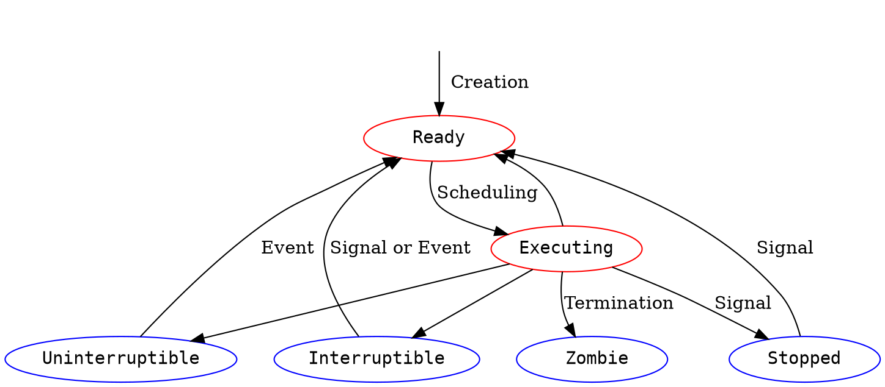

## Zadanie 3-1
- **stan procesu** 
  Stan wykonania procesu, stan, w jakim znajduje się proces.
- **blokada sygnału** ([mimuw](https://students.mimuw.edu.pl/SO/LabLinux/PROCESY/PODTEMAT_3/sygnaly.html))
  oznacza, że proces nie będzie reagował na sygnał danego typu, ale informacja o tym, że on nadszedł jest pamiętana i zostanie on obsłużony w momencie, gdy go odblokujemy.
  w /proc/pid/status:
  **SigBlk:** Maska (wyrażone szesnastkowo) wskazująca blokowanie sygnałów
- **ignorowanie sygnału**
   oznacza, że proces nie reaguje na sygnał, nie obsługuje go
   w /proc/pid/status:
   **SigIgn:** Maska (wyrażone szesnastkowo) wskazująca ignorowanie sygnałów

### Stany Procesu

$_\text{graf starający się przypomianć ten z książki:}$

$_\text{Czerwone stany odpowiadają stanowi Running}$


- **Running:** ta wartość stanu odpowiada dwóm stanom. Uruchomiony proces jest w trakcie wykonywania (*Executing*) lub jest gotowy do wykonania (*Ready*).
- **Interruptible:** jest to stan zablokowany, w którym proces oczekuje na zdarzenie, takie jak zakończenie operacji we / wy, dostępność zasobu lub sygnał z innego procesu.
- **Uninterruptible:** jest to kolejny stan zablokowany. W stanie nieprzerywalnym proces oczekuje bezpośrednio na warunki sprzętowe i dlatego nie będzie obsługiwał żadnych sygnałów.
- **Stopped:** proces został zatrzymany i można go wznowić tylko poprzez pozytywne działanie innego procesu. Na przykład debugowany proces można ustawić w stan zatrzymania.
- **Zombie:** Proces został zakończony, ale z jakiegoś powodu nadal musi mieć strukturę zadań w tabeli procesów.

DODATKOWY OPIS:
**sen nieprzerywalny**
:::spoiler

 według [eklitzke.org](https://eklitzke.org/uninterruptible-sleep):
 Stan „nieprzerywalnego snu” to stan, w który może wejść proces podczas wykonywania pewnych wywołań systemowych. W tym stanie proces jest blokowany podczas wykonywania wywołania systemowego i nie można go przerwać (ani zabić) do momentu zakończenia wywołania systemowego. Większość tych nieprzerywalnych wywołań systemowych jest w rzeczywistości natychmiastowych, co oznacza, że nigdy nie obserwujesz nieprzerywalności wywołania systemowego. W rzadkich przypadkach (często z powodu błędnych sterowników jądra, ale prawdopodobnie z innych powodów) proces może utknąć w tym nieprzerywalnym stanie. Jest to bardzo podobne do stanu procesu zombie w tym sensie, że nie można zabić procesu w tym stanie, chociaż warto, aby oba przypadki miały miejsce z różnych powodów. Zazwyczaj, gdy proces jest zaklinowany w nieprzerywanym stanie uśpienia, jedynym rozwiązaniem jest ponowne uruchomienie systemu, ponieważ dosłownie nie ma sposobu, aby go zabić.
:::
### Akcje albo zdarzenia wyzwalające zmiany stanów procesów

- operacja I/O --- proces ze stanu Running przechodzi w Interruptible oczekując na zakończenie operacji I/O
- kill -SIGTERM --- proces ze stanu Running przechodzi w stan Zombie
- wysłanie sygnału SIGTSTP (Ctrl+Z) --- proces ze stanu Running przechodzi w stan Stopped

### Przejścia, które mogą być rezultatem działań podejmowanych przez: 

#### jądro systemu operacyjnego:

Executing -> Ready : Gdy process trwa zbyt długo to jądro systemu może zmienić jego stan

#### kod sterowników:

Interruptible -> Running: Powiadomienie o dostępnym pakiecie przez kartę sieciową może zmienić stan procesu

#### proces użytkownika:

Running -> Stopped: Wysłanie sygnału zatrzymującego (np Ctrl+Z w terminalu lub kill -SIGTSTP \<pid\> wysłany przez proces) przez proces do innego procesu, przez co zmieni się jego stan

### Sen przerywalny vs sen nieprzerywalny

Różnica między snem nieprzerywalnym (*Uninterruptible*), a przerywalnym (*Interruptible*) polega na tym, że w śnie nieprzerywalnym proces oczekuje bezpośrednio na warunki sprzętowe i dlatego nie będzie obsługiwał żadnych sygnałów, natomiast podczas snu przerywalnego proces oczekuje na zdarzenie, takie jak zakończenie operacji we / wy, dostępność zasobu lub sygnał z innego procesu. 

### Czy proces może **zablokować** lub **zignorować** sygnał «SIGKILL»?

#### man signal:
>The signals SIGKILL and SIGSTOP cannot be caught, blocked, or ignored.

**Ignore signal:**

Działa to dla większości sygnałów, ale **nigdy nie można zignorować dwóch sygnałów: SIGKILL i SIGSTOP**. Powodem, dla którego nie można zignorować tych dwóch sygnałów, jest **zapewnienie jądru i superużytkownikowi niezawodnego sposobu na zabicie lub zatrzymanie dowolnego procesu**. 

## Zadanie 3-2
Pod linuxem możemy stworzyć proces wywołując `fork`, co jest bardzo szybkie, bo jest to nadal ten sam kod, na dodatek pamięć jest inteligentnie współdzielona, czego nie ma pod Windowsem (WinNT - kernel), przy czym i tak często po `fork` następuje `execve`, które i tak będzie musiało od nowa ładować strony pamięci.

Linux:

* reprezentuje procesy jako zadania `task_struct` (tak samo jak np. wątki)
* `task_struct` zawiera m.in. informacje dla schedulera, listę open-file descriptors itp.
* identyfikuje procesu po PID
* tworzenie procesu -- większość informacji jest kopiowanych od rodzica, ustawiany jest współdzielony dostęp do pamięci rodzica, na koniec usawiane są rejestry i proces może zacząć działać
* `fork` -- system przechodzi do kernel mode i jest tworzona `task_struct` na podstawie rodzica (linux szuka wolnego PID, aktualizuje tablicę haszującą PID), struktura ta jest zaalokowana w miejscu pamięci z ustalonym offsetem względem końca stosu procesu, aby przyspieszyć kopiowanie pamięci, stosujemy **kopiowanie przy zapisie**, czyli nie kopiujemy pamięci a tablice stron oznaczamy read-only i gry rodzic lub dziecko chce coś nadpisać, dostaje błąd strony i dopiero wtedy jądro kopiuje wybraną stronę i oznacza ją read/write,
* `execve` -- jądro szuka i weryfikuje podany plik, zwalnia stare tablice stron, ale nowych nie tworzy, na początku dostęp do tablicy stron z kodem zakończy się błędem, a kod zostanie pobrany z pliku wykonywalnego, dzięki temu nie ładujemy nic nadmiarowo, argumenty i zmienne środowiskowe są kopiowane na stos


> [name=Michał Myczkowski]
<details>
<summary>Polska wersja grafiki</summary>

</details>


## Zadanie 3-3

```
FORK
(a) the fork() function creates a new process. 
The new process (the child process) is an exact copy of the calling process (the parent process). 
The child process inherits the following attributes from the parent process:
• Real and effective user and group IDs - real user id is the one who owns the process(acutal user), 
	and the effective user id is what the operating system looks at to make a decision 
	whether or not you are allowed to do something.
• Environment settings - USER, LOGNAME (The name of the logged-in user), 
	HOME (A user's login directory - the home directory),  
	LANG - the name of a locale to use for locale categories when not overridden by LC_ALL
	PATH - The sequence of directory prefixes that programs apply in searching for a file 
            with incomplete pathname.
	PWD - The current working directory.
	TERM - The terminal type for which output is to be prepared.
• Signal handling settings - signal handlers
    (prototpye: void <signal handler func name> (int sig))
• Attached shared memory segments - A shared memory is an extra piece of memory 
    that is attached to some address spaces for their owners to use. 
    As a result, all of these processes have access to it.
• Memory mapped segments -  segment of the virtual memory of a process, 
    where a file or file-like resource is loaded into.
• Process group ID
• Current working directory
• File mode creation mask - four-digit octal number that UNIX uses to 
    determine the file permission for newly created files.
• Controlling terminal - One of the attributes of a process is its 
    controlling terminal. All the processes in a session inherit 
    the controlling terminal from the session leader.
    
---------------------------------------------------------------------------

The child process differs from the parent process in the following ways:
• The child process has a unique process ID, which also does not match any active process group ID.
• The child process has a different parent process ID (that is, the process ID of the process that called fork()).
• The child process has its own copy of the parent's file descriptors 
    (it is an integer that uniquely represents the open file in the operating system)
    Each of the child's file descriptors refers to the same open file structures
    as the file descriptor of the parent.
• The child process has its own copy of the parent's open directory streams.
• The child process' process execution times are set to zero.
• Pending alarms are cleared for the child (we don't want the parent process alarms 
    to be triggered in the new process)
• File locks set by the parent process are not inherited by the child process. 
    (File locking is a mechanism to restrict access to a file among multiple processes. 
    It allows only one process to access the file in a specific time, 
    thus avoiding the interceding update problem.)
• The set of signals pending for the child process is cleared.
```

```
EXECVE
(b) 
• File descriptors open in the calling process image remain open in the new process, 
	except for those whose close-on-exec flag (FD_CLOEXEC) is set. 
	For those file descriptors that remain open, all attributes of the open file description, 
	including file locks, remain unchanged.
• Directory streams open in the calling process are closed in the new process image.
• For the new process, the equivalent of: setlocale(LC_ALL, "C"); is executed at startup.
• Signals set to the default action (SIG_DFL) in the calling process image are set to
	the default action in the new process image. Signals set to be ignored (SIG_IGN) 
	by the calling process image are set to be ignored by the new process image. 
	Signals set to be caught in the calling process image are set to 
	the default action in the new process image.
• Shared memory or memory mapped segments attached to the calling process 
	are NOT attached to the new process image.
New process inherits the following attributes from the calling process:
• Process ID
• Parent process ID
• Process group ID
• Session membership - processes are organized into sets of sessions. 
	The session's ID is the same as the pid of the process that created the session
	through the setsid() system call.
• Real user ID
• Real group ID
• Time left until an alarm clock signal
• Current working directory
• File mode creation mask
• Process signal mask - the collection of signals that are currently blocked is called the signal mask
• Pending signals
• Process execution times, as returned by times()
• Controlling terminal
```

- When you fork the process in, the child processes inherits every part of the parent process, including the unflushed output buffer. This effectively copies the unflushed buffer to each child process. So each child process would read the same buffer. It is good practice to call fflush() on all streams with pending output before calling fork() or to let the forked child call explicitly _exit() that only exits the process without flushing the stdio streams.

- Moze zdarzyc sie sytuacja, w której proces zmieni standardowa obsługę pewnych sygnałów, a nastepnie wywola inny program poleceniem exec. Nie zawsze pozostawienie niezmienionej obsługi sygnałów przy zmianie kontekstu da oczekiwany wynik (przy czyszczeniu shared memory czy stack/heap kod obsługi sygnałów mogl przestac istniec). Z drugiej strony, przywrócenie standardowej obsługi wszystkich sygnałów pozbawiłoby twórców oprogramowania silnego narzędzia programistycznego. Wybrane w Unixie rozwiązanie kompromisowe przywraca standardowa obsługę tylko tych sygnałów, dla których ustawiono wcześniej nowa procedure obslugi. Oznacza to, ze sygnały, które były ignorowane w programie wywołującym, pozostaną takimi w programie wywoływanym. Za zmianę sposobu reagowania na sygnały odpowiada procedura flush_old_signals.


## Zadanie 3-4

:::info
z.4 Uruchom program «xeyes» po czym użyj na nim polecenia «kill», «pkill» i «xkill».
Który sygnał jest wysyłany domyślnie? Przy pomocy kombinacji klawiszy «CTRL+Z» wyślij «xeyes» sygnał
«SIGTSTP», a następnie wznów jego wykonanie. Przeprowadź inspekcję pliku «/proc/pid/status» i wyświetl
maskę sygnałów oczekujących na dostarczenie. Pokaż jak będzie się zmieniać, gdy będziemy wysyłać
wstrzymanemu procesowi kolejno: «SIGUSR1», «SIGUSR2», «SIGHUP» i «SIGINT». Co opisują pozostałe pola
pliku «status» dotyczące sygnałów? Który sygnał zostanie dostarczony jako pierwszy po wybudzeniu procesu?

:::

" xeyes - a follow the mouse X demo "

«kill», «pkill» i «xkill» domyślnie wysyłają sygnał «SIGTERM» który w przeciwieństwie do «SIGKILL» może być obsłużony lub zignorowany przez program.


Fragment wypisu polecenia: > *man 7 proc*
dotyczący pliku proc/[pid]/status
```
 * SigQ:  This  field  contains two slash-separated numbers that relate to queued signals for the real user ID of this process.  The first of these is the number of currently queued signals for
                this real user ID, and the second is the resource limit on the number of queued signals for this process (see the description of RLIMIT_SIGPENDING in getrlimit(2)).

* SigPnd, ShdPnd: Mask (expressed in hexadecimal) of signals pending for thread and for process as a whole (see pthreads(7) and signal(7)).

* SigBlk, SigIgn, SigCgt: Masks (expressed in hexadecimal) indicating signals being blocked, ignored, and caught (see signal(7)).
```

maska shdpnd przed wyslaniem sygnałów:
ShdPnd:	0000000000000000
maska shdpnd po SIGUSR1:
ShdPnd:	000000000000020
maska shdpnd po SIGUSR2:
ShdPnd:	0000000000000a00
maska shdpnd po SIGHUP:
ShdPnd:	0000000000000a01
maska shdpnd po SIGINT:
ShdPnd:	0000000000000a03


sygnały zostaną dostarczone w kolejności:
SIGHUP  (1)
SIGINT  (2)
SIGUSR1 (10)
SIGUSR2 (12)

ponieważ jest to kolejność w jakiej zostały zdefiniowane na moim systemie:

```
$ kill -l

 1) SIGHUP	 2) SIGINT	 3) SIGQUIT	 4) SIGILL	 5) SIGTRAP
 6) SIGABRT	 7) SIGBUS	 8) SIGFPE	 9) SIGKILL	10) SIGUSR1
11) SIGSEGV	12) SIGUSR2	13) SIGPIPE	14) SIGALRM	15) SIGTERM
16) SIGSTKFLT	17) SIGCHLD	18) SIGCONT	19) SIGSTOP	20) SIGTSTP
21) SIGTTIN	22) SIGTTOU	23) SIGURG	24) SIGXCPU	25) SIGXFSZ
26) SIGVTALRM	27) SIGPROF	28) SIGWINCH	29) SIGIO	30) SIGPWR
31) SIGSYS	34) SIGRTMIN	35) SIGRTMIN+1	36) SIGRTMIN+2	37) SIGRTMIN+3
38) SIGRTMIN+4	39) SIGRTMIN+5	40) SIGRTMIN+6	41) SIGRTMIN+7	42) SIGRTMIN+8
43) SIGRTMIN+9	44) SIGRTMIN+10	45) SIGRTMIN+11	46) SIGRTMIN+12	47) SIGRTMIN+13
48) SIGRTMIN+14	49) SIGRTMIN+15	50) SIGRTMAX-14	51) SIGRTMAX-13	52) SIGRTMAX-12
53) SIGRTMAX-11	54) SIGRTMAX-10	55) SIGRTMAX-9	56) SIGRTMAX-8	57) SIGRTMAX-7
58) SIGRTMAX-6	59) SIGRTMAX-5	60) SIGRTMAX-4	61) SIGRTMAX-3	62) SIGRTMAX-2
63) SIGRTMAX-1	64) SIGRTMAX
```

## Zadanie 3-5

**Sieroty** to te procesy, które nadal działają, mimo że ich parent proces został zakończony.

**Żniwiarz** (reaper) pełni rolę init dla swoich procesów potomnych. Kiedy proces zostanie osierocony tj. jego bezpośredni rodzic zostanie zakończony), wówczas ten proces zostanie przekazany najbliższemu wciąż żyjącemu żniwiarzowi.
<details>
  <summary>Stary kod</summary>

```c=
#include "csapp.h"

static pid_t spawn(void (*fn)(void)) {
  pid_t pid = Fork();
  if (pid == 0) {
    fn();
    printf("(%d) I'm done!\n", getpid());
    exit(EXIT_SUCCESS);
  }
  return pid;
}

static void grandchild(void) {
  printf("(%d) Waiting for signal!\n", getpid());
  pause();
  printf("(%d) Got the signal!\n", getpid());
}

static void child(void) {
  pid_t pid;
  setpgid(0,0);
  pid = spawn(grandchild);
  printf("(%d) Grandchild (%d) spawned!\n", getpid(), pid);
  exit(0);
}

static void ps(void) {
  char *const parmList[] = {"/bin/ps", "-o", "pid,ppid,pgrp,stat,cmd", NULL};
  execve("/bin/ps", parmList, 0);

}


int main(void) {
#ifdef LINUX
  Prctl(PR_SET_CHILD_SUBREAPER, 1);
#endif
  printf("(%d) I'm a reaper now!\n", getpid());

  pid_t pid;
  int status;

  pid = spawn(child);
  
  waitpid(pid, &status, 0);
  
  spawn(ps);
  
  waitpid(0, &status, 0);
  
  kill(-pid,2);
  
  waitpid(-1, &status, 0);
  
  if (WIFSIGNALED(status)) {
    printf("(%d) Exited due to receiving signal %d\n", getpid(), WTERMSIG(status));
  }
  

  return EXIT_SUCCESS;
}
```
</details>

<details>
  <summary>Stary kod z komentarzem</summary>

```c=

  pid_t ps_pid = spawn(ps);
  
  waitpid(ps_pid, &status, 0); // czekamy na ps
  
  kill(-pid,SIGINT); // wysyłamy SIGINT do grupy z numerem pid(dziecka)
  
  waitpid(-pid, &status, 0); // czekamy na zakończenie procesu grupy pid(dziecka)
  
  if (WIFSIGNALED(status)) { //zwraca prawdę, jeśli proces potomny został zakończony sygnałem.
    // wypisuje numer sygnalu
    printf("%d Exited due to receiving signal %d. Status %d \n", getpid(), WTERMSIG(status),WEXITSTATUS(status))
```

```=
(4334) I'm a reaper now!
(4335) Grandchild (4336) spawned!
(4336) Waiting for signal!
  PID  PPID  PGRP STAT CMD
 2509  2500  2509 Ss   bash
 4334  2509  4334 S+   ./reaper
 4336  4334  4335 S    ./reaper
 4337  4334  4334 R+   /bin/ps -o pid,ppid,pgrp,stat,cmd
(4334) Exited due to receiving signal 2. Status 0

```
Na wydruku jest widoczny main proces w linii 6.
I proces grandchild w linii 7.
W linii 9 jest wpisany numer sygnału i kod wyjścia wnuku.

**Kod wyjścia** wykonanego polecenia to wartość zwracana przez wywołanie systemowe waitpid.
Polecenie, które kończy pracę z zerowym kodem wyjścia, wywołując exit (3) lub _exit (2), lub powracając z funkcji main ().

SIGINT ma kod 2
  
</details>

## Zadanie 3-6

Procedura `play()`
```c=
static void play(pid_t next, const sigset_t *set) {
  for (;;) {
    printf("(%d) Waiting for a ball!\n", getpid());
    /* TODO: Something is missing here! */
    Sigsuspend(set);

    usleep((300 + random() % 400) * 1000);
    Kill(next, SIGUSR1);
    printf("(%d) Passing ball to (%d)!\n", getpid(), next);
  }
}

```

Kod tworzący procesy, które czekają na syganł **SIGUSR1**

```c= 
/* TODO: Start all processes and make them wait for the ball! */

  pid_t pid = 0, next = getpid();
  sigset_t empty, block_mask;
  
  sigemptyset(&empty);
  sigemptyset(&block_mask);
  sigaddset(&block_mask, SIGUSR1);

  Sigprocmask(SIG_BLOCK, &block_mask, NULL);

  for (int i = 0; i < children; ++i) {
    pid = Fork();
    if (pid == 0) 
      play(next, &empty);
    else 
      next = pid;
  }
  
  Kill(pid, SIGUSR1);
  play(pid, &empty);
  
```


## Zadanie 3-7

**procedura obsługi sygnału** --- procedura działająca w trybie użytkownika, wołana kiedy proces otrzyma sygnał określonego typu. Typ sygnału, obsługiwanego przez procedurę, określany jest w momencie instalacji przy użyciu procedury `signal`.

**procedura wielobieżna** (ang. *reentrant procedure*) --- procedura, którą można bezpiecznie wywołać z wnętrza procedury obsługi sygnału. Taka procedura nie może korzystać z zasobów współdzielonych przez pozostałe fragmenty programu, jak np. zmienne globalne, bufory stdio.

Niektóre procedury wielobieżne wg podręcznika `signal-safety(7)`:
* `read`
* `write`
* `wait`
* `safe_printf`
* `sleep`

Uzupełniony fragment procedury:
```c=
static void sigsegv_handler(int signum, siginfo_t *info, void *data) {
  ucontext_t *uc = data;
  intptr_t rip;

  /* TODO: You need to get value of instruction pointer register from `uc`.
   * Print all useful data from `info` and quit in such a way that a shell
   * reports program has been terminated with SIGSEGV. */
  rip = uc->uc_mcontext.gregs[16]; // rip = uc->uc_mcontext.gregs[REG_RIP];
  safe_printf("Fault at rip=%lx accessing %lx!", rip, (long)(info->si_addr));
  if (ADDR_START <= info->si_addr && info->si_addr < ADDR_END) {
    void *addrAligned = (void*)((long)(info->si_addr) >> 12 << 12 );
    if (info->si_code == SEGV_MAPERR) {
      safe_printf(" Map missing page at %lx.\n", (long)(addrAligned));
      mmap_page(addrAligned, PROT_WRITE);
    } else if (info->si_code == SEGV_ACCERR) {
      safe_printf(" Make page at %lx writable.\n", (long)(addrAligned));
      mprotect_page(addrAligned, PROT_WRITE);
    }
  } else {
    safe_printf(" Address not mapped - terminating!\n");
    exit(128+SIGSEGV);
  }
}
```

```
$ ./demand
Fault at rip=0x564922031468 accessing 0x100003e0! Make page at 0x10000000 writable.
Fault at rip=0x564922031468 accessing 0x10001610! Map missing page at 0x10001000.
...
Fault at rip=0x56492203147b accessing 0x10010000! Address not mapped - terminating!
$ kill -l $?
SEGV
```
