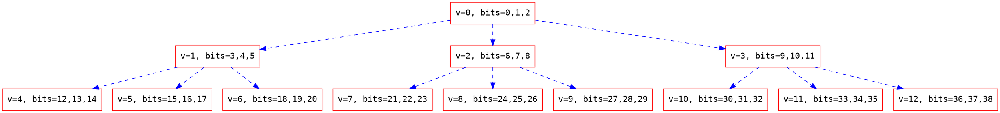

## Zadanie 8-1


Wyobraźmy sobie sytuację, w której `malloc` korzysta z wywołania systemowego `sbrk`. Na początku naszego programu alokujemy duży blok pamięci, a następnie alokujemy kolejne bloki danych, ich rozmiar nie ma już znaczenia. Następnie zwalniamy duży blok pamięci zaalokowany na początku. Wtedy miejsce, które zostanie zwolnione, przepada, bo wrzucać możemy tylko na górę sterty. Prowadziłoby to do marnotrawstwa pamięci.

## Zadanie 8-2

### **fragmentacja wewnętrzna**

Pamięć przypisana dla konkretnego bloku jest większa niż to potrzebne, co sprawia, że jest blokowana dla innych bloków, które jej potrzebują. 
Część pamięci pozostaje niewykorzystana, a nie moze zostać przypisana dopóki nie zwolnimy całego zaalokowanego bloku.

> książka:
> Wewnętrzna fragmentacja pojawia się, gdy przydzielony jest wystarczająco duży wolny blok do przechowywania obiektu, ale dopasowanie jest słabe, ponieważ blok jest większy niż potrzeba. W niektórych podzielnikach reszta jest po prostu marnowana, powodując wewnętrzną fragmentację. (Nazywa się to wewnętrzną, ponieważ zmarnowana pamięć znajduje się wewnątrz przydzielonego bloku, a nie jest rejestrowana jako samodzielny blok).
> 

### **fragmentacja zewnętrzna**

Liczba bajtów w wolnych blokach jest wystarczająca do zaalokowania potrzebnej pamięci, natomiast nie jest to ciągły spójny obszar pamięci, więc nie możemy go zaalokować

Zewnętrzną fragmentacją można zmniejszyć  przez zagęszczenie lub przetasowanie zawartości pamięci, aby umieścić całą wolną pamięć w jednym dużym bloku.

Zależy od kolejnosci w jakiej wykonujemy nasze operacje oraz od polityk alokowania pamięci.

> książka:
> Fragmentacja zewnętrzna pojawia się, gdy wolne bloki pamięci są dostępne do alokacji, ale nie można ich użyć do przechowywania obiektów o rozmiarach faktycznie żądanych przez program. W wyrafinowanych alokatorach dzieje się tak zwykle dlatego, że wolne bloki są zbyt małe, a program żąda większych obiektów. W niektórych prostych alokatorach może wystąpić zewnętrzna fragmentacja, ponieważ alokator nie chce lub nie może podzielić dużych bloków na mniejsze.
> 


### **kompaktowanie**

Przesuwanie zajętych bloków tak, żeby możliwie jak najwięcej wolnych bloków połączyło się w ciągłe obszary. 

Kompaktowanie jest możliwe tylko wtedy, gdy zarządca ma pełne informacje o pamięci i jej wykorzystaniu przez program - zwykle możliwe do zrealizowania w aplikacjach używających odśmiecania.

Nie mozemy tego zrobić, ponieważ po każdym przydzieleniu pamięci otrzymaliśmy już wskaźniki, których używamy, aby dostać się do przydzielonego bloku pamięci, a więc używanie tych wskaźników po kompaktowaniu byłoby niemożliwe, nie mielibyśmy dostępu do przydzielonej pamięci, bo zostałaby ona przesunięta (dostalibyśmy się do innej pamięci, co również nie jest pożądane).

### **Dwie główne przyczyny występowania fragmentacji zewnętrznej**
 
**Fragmentacja jest spowodowana pojedynczymi zgonami.**
Kluczową kwestią jest tworzenie wolnych obszarów, których sąsiednie obszary nie są wolne. 
 Jest to funkcja dwóch rzeczy: 
 - które obiekty są umieszczane w sąsiednich obszarach, 
 - kiedy te obiekty umierają. 
 
Jeśli alokator umieszcza obiekty razem w pamięci i umierają one „w tym samym czasie” (bez interwencji alokacji), nie ma wyników fragmentacji: obiekty żyją w tym samym czasie, używając ciągłej pamięci, a kiedy umierają, uwalniają się ciągła pamięć. 
Jeśli jednak przydzielamy pamięć i zwalnia się ona losowo (zwalniają się bloki pomiędzy którymi mieszczą się bloki zajęte) to dostępna pamięć dzieli się na mniejsze rozrzucone fragmenty, które nie mogą być zaalokowane jako spójna całość.
 
**Fragmentacja jest spowodowana zachowaniem zmiennym w czasie.**
Fragmentacja wynika ze zmian w sposobie wykorzystania pamięci przez program - na przykład uwalnianie małych bloków i proszenie o duże.
To oczywiste, ale ważne jest, aby wziąć pod uwagę wzorce w zmieniającym się zachowaniu programu, takie jak zwalnianie dużej liczby obiektów i przydzielanie dużej liczby obiektów różnych typów. Wiele programów przydziela i zwalnia różne rodzaje obiektów na różne stereotypowe sposoby. Niektóre rodzaje obiektów gromadzą się w czasie, ale inne mogą być używane w seriach. Zadaniem alokatora jest wykorzystanie tych wzorców, jeśli to możliwe, lub przynajmniej nie pozwolenie, aby wzorce osłabiły jego strategię.


## Zadanie 8-3

Rozróżniamy trzy główne wzorce przydziału pamięci w programach:
- szczyt? (peak) - nagłe użycie bardzo dużej ilości pamięci oraz jej zwolnienie
- pochylnia? (ramp) - stopniowe zwiększenie zużycia pamięci
- płaskowyż? (plateaus) - szybkie zgromadzenie dużej ilości pamięci i używanie jej przez większość programu


Wykresy przedstawiają zależność używanych danych w programie podczas działania w stosunku do ilości danych zaalokowanych przez 5 najbardziej "popularnych" rozmiarów, czyli tych, które były największe pod względem całkowitej zaalokowanej pamięci.


Program służący przepisaniu złożonych wyrażeń na kombinacje wielomianów. Obserwujemy stopniowy wzrost pamięci wraz z wariacjami płaskowyżu.


Kompilator GCC kompilując plik ze swojego własnego kodu źródłowego `combine.c`. Dla różnych rozmiarów bloków przejawia różne wzorce przydziału pamięci.


Program na początku działania przydziela dużo pamięci, a następnie korzysta z niej przez wykonanie.

#### Związek między czasem życia bloku a jego rozmiarem

Jeśli alokowane są bloki o takich samych rozmiarach istnieje duże prawdopodobieństwo, że są tych samych typów. Jeżeli alokowane są struktury tych samych typów to mogą one służyć w podobny sposób, a co za tym idzie, zostać zwolnione w tym samym czasie. Stąd nie zaleca się ustawiania bloków różnych rozmiarów w jednolitym obszarze pamięci, bo może się okazać, że będą zwalniane w bardzo różnych czasach, co sprzyja fragmentacji zewnętrznej. 

#### **First-fit** 
Wybiera pierwszy wolny blok o rozmiarze większym lub równym jak żądany jako kandydata do alokacji. Jeśli blok jest za duży dzieli go na części (splitting).

Zalety:
- Może działać liniowo.
- Prosty w implementacji.

Wady:
- Może powodować dużą fragmentację zewnętrzną. 

Ze względu na to, że first-fit zawsze zaczyna przeszukiwanie od początku listy. Sprawia to, że większe bloki, które występują na początku stosu są często dzielone i tworzą się małe bloki na początku sterty. Wydłuża to czas przeszukiwania, ponieważ każdy z tych małych bloków musi być sprawdzony.

#### **Next-fit** 
Algorytm pamięta miejsce, w którym ostatnio zakończył przeszukiwanie, a następnie wybiera pierwszy wolny blok o odpowiednim rozmiarze.

Zalety:
- Działa zwykle szybciej niż first-fit.
- Nie powoduje powstawania tylu małych bloków na początku sterty co first-fit -- za każdym razem zaczyna przeszukiwanie w innym miejscu, tym samym, nawet jeśli tworzy te małe bloki to są one względnie rozrzucone po stercie.

Wady:
- Może pogarszać lokalność. 
- Może powodować większą fragmentację. Obiekty o różnych rozmiarach, z różnych faz programu umieszczane są obok siebie -- mają one prawdopodobnie inne przeznaczenie oraz różną długość życia.


#### **Best-fit** 
Znajduje najmniejszy blok o rozmiarze wystarczającym dla bieżącego zapytania.

Zalety:
- Minimalizuje fragmentację zewnętrzną.

Wady:
- Zwykle działa wolniej. Jeśli nie znajdzie idealnego bloku to musi przejść całą stertę i sprawdzić każdy wolny blok.
- Niezbyt nadaje się dla dużych stert.


## Zadanie 8-4

**gorliwe złączanie** - dołączanie do siebie sąsiadujących wolnych bloków tak szybko jak tylko jest to możliwe, zazwyczaj w momencie zwalniania jednego z nich.


## Zadanie 8-5

**algorytm kubełkowy** (ang. *segregated-fit*) --- polega na wykorzystaniu tablicy list wolnych bloków, gdzie każda lista przechowuje wolne bloki z ustalonej klasy rozmiaru. Klasy rozmiaru można zdefiniować dowolnie, np. można powiedzieć, że do $i$-tej klasy należą bloki o rozmiarze z przedziału $[2^i, 2^{i+1}-1]$ słów.

##### Jak przebiegają operacje `«malloc»` i `«free»`?
###### `«malloc»`
Dla ustalonego rozmiaru żądanej pamięci, algorytm próbuje znaleźć wolne miejsce na liście przechowującej bloki z tej samej klasy rozmiaru.
Jeśli takiego miejsca nie ma, algorytm kontynuuje poszukiwania na liście przechowującej bloki z kolejnej klasy rozmiarów. Ewentualny znaleziony blok jest rozdzielany.
Jeśli i to zawiedzie, przeszukiwane są kolejne klasy aż do skutku.
Jeśli w liście ostatniej klasy rozmiarów nie ma wolnego miejsca, algorytm alokuje dodatkową pamięć z systemu operacyjnego.
###### `«free»`
Dla wskazanego bloku, alokator gorliwie łączy go z ewentualnymi sąsiadującymi wolnymi blokami, a następnie wstawia go do listy wolnych bloków, obsługującej jego klasę rozmiaru. Wstawianie można zrealizować na różne sposoby, np. wstawianie na początek listy lub wstawianie według kolejności adresów.

##### Jak poradzić sobie w trakcie złączania wolnych bloków w procedurze `«free»`, jeśli chcemy usunąć ostatni element z listy?
###### Przykład
Lista wolnych bloków określonej klasy rozmiaru ma jeden wolny blok rozmiaru np. 10 słów.
Zwalniamy blok o rozmiarze 11 słów, sąsiadujący z jedynym wolnym blokiem powyższej listy. Wykonujemy gorliwe złączanie.
Otrzymany wolny blok ma rozmiar 21 słów --- jest z innej klasy rozmiaru. Powinien zostać wstawiony do listy odpowiadającej jego klasie.
Co zrobić z poprzednią listą?

Możliwe wyjścia:
* Wpisać *null* w odpowiadającym jej miejscu tablicy kubełków. Czyli pozbawiamy się klasy rozmiaru, której odpowiadała ta lista.
* Wyjątkowo w tej sytuacji nie wykonywać złączania, zostawiając na liście dwa wolne bloki z tej samej klasy rozmiaru.

**leniwe złączanie** --- polega na odwlekaniu złączania dopóki nie będzie konieczne. Możliwe podejścia to np. złączanie podczas wyszukiwania wolnych bloków lub gdy fragmentacja zewnętrzna przekroczy pewien próg.

##### Problemy z leniwym złączaniem w algorytmie kubełkowym przydziału pamięci
* Przy gorliwym złączaniu koszt czasowy jest rozdzielony pomiędzy wszystkie operacje `«free»`. W przypadku leniwego złączania, płacimy jednorazowo większy koszt czasowy, potrzebny na złączenie $n$ wolnych bloków.
* W porównaniu do gorliwego złączania, leniwe złączanie jest trudniejsze w implementacji. (Czy tworzyć jeden duży blok? Czy dzielić go na mniejsze? Jeśli dzielić, to na ile bloków i jakiej wielkości?)

## Zadanie 8-6


Części kodu które mieliśmy wypełnić oznaczone są przez TODO:
```c=
static arena_t *init_arena(arena_t *ar) {
  /* TODO: Calculate nitems given ARENA_SIZE, size of arena_t and object_t. */

  /* wyliczamy ile miejsca mamy na objekty i na bitmapę */
  size_t nitems = ( ARENA_SIZE - sizeof( arena_t ) ) / sizeof( object_t );
  
  /* wyliczamy stosunek ilości objektów które możemy trzymać do bitmapy która */
  while( nitems * sizeof( object_t ) + bitstr_size( nitems ) + sizeof( arena_t ) > ARENA_SIZE ) 
    nitems -= sizeof( object_t );

  ar->nitems = nitems;
  ar->nfree = nitems;
  /* Determine items address that is aligned properly. */
  ar->items = arena_end(ar) - nitems * sizeof(object_t);
  return ar;
}

static void *alloc_block(arena_t *ar) {
  assert(ar->nfree > 0);
  int index;
  /* TODO: Calculate index of free block and mark it used, update nfree. */
  /* znajdujemy pierwszy wolny blok (pierwszy zerowy bit) */
  bit_ffc( ar->bitmap, ar->nitems, &index );
  /* zmieniamy stan bloku z wolnego na wykorzystany */
  bit_set( ar->bitmap, index );
  /* zmniejszamy ilość wolnych bloków */
  ar->nfree--;
  return ar->items + sizeof(object_t) * index;
}

static void free_block(arena_t *ar, void *ptr) {
  int index = (ptr - ar->items) / sizeof(object_t);
  /* TODO: Determine if ptr is correct and mark it free, update nfree. */
  /* upewniam się, że index wskazuje na obiekt wewnątrz naszej areny */
  /* i sprawdzam, czy użytkownik nie próbuje zwolnić wolnego już bloku */
  assert( ( index >= 0 && index < ar->nitems ) && bit_test( ar->bitmap, index ) );
  /* czyścimy blok i zwiększamy ilość wolnych bloków */
  bit_clear( ar->bitmap, index );
  ar->nfree++;

}
```


**bitmapowy przydział** - metoda śledzenia zaalokowanych sektorów pamięci po przez zaznaczanie 1 przydzielonego bloku i 0 bloku wolnego w strukturze bitmapy którą trzymamy zewnętrznie od danych.

## Zadanie 8-7

W moim rozwiązaniu bitem `1` (zamiast bitem`0`) w bitmapie oznaczam, że dany blok pamięci jest wolny. Wielopoziomową strukturę bitmapy reprezentuje jako drzewo 32-arne (`sizeof(int) == 32`). Drzewo składa się z `nitems` liści (ostatni poziom bitmapy) - `1` wskazuje na to, że dany block jest wolny, `0`, że jest zajęty. W `k-1` poziomie mapy, zapalony bit na `i-tym` miejscu oznacza, że w `i-tym` słowie maszynowym `k-tego` poziomu mapy jest zapalony przynajmniej jeden bit. Zgodnie ze strukturą drzewa `32`-arnego, na `k-1` poziomie mapy jest `32` razy mniej bitów niż na poziomie `k-tym`.

Wygląd drzewa, gdy słowo maszynowe składa się z `3` bitów, a `nitems` wynosi $27$.


Kod źródłowy:
```c=
typedef int word_t;
#define WORD_LEN (8 * sizeof(word_t))
#define TREE_SIZE(n) (WORD_LEN * ((n) - 1) + WORD_LEN - 2) / (WORD_LEN - 1)
#define WORD_ALIGN(x) ((x) + WORD_LEN - 1) / WORD_LEN * WORD_LEN

static arena_t *init_arena(arena_t *ar) {
  /* TODO: Calculate nitems given ARENA_SIZE, size of arena_t and object_t. */
  size_t nitems = (ARENA_SIZE - sizeof(arena_t)) / sizeof(object_t) + 1;
  size_t need, need_arena, need_items, need_bitstring;
  do {
    assert(--nitems > 0);
    need_arena = sizeof(arena_t);
    need_items = nitems*sizeof(object_t);
    need_bitstring = bitstr_size(WORD_ALIGN(TREE_SIZE(nitems)));
    need = need_arena + need_items + need_bitstring;
  } while (need > ARENA_SIZE);

  bit_nset(ar->bitmap, 0, TREE_SIZE(nitems)-1);
  for (int i = 0; i < TREE_SIZE(nitems); ++i)
    assert(bit_test(ar->bitmap, i));

  ar->nitems = nitems;
  ar->nfree = nitems;
  /* Determine items address that is aligned properly. */
  ar->items = arena_end(ar) - nitems * sizeof(object_t);
  return ar;
}

static void *alloc_block(arena_t *ar) {
  assert(ar->nfree > 0);
  int index;
  /* TODO: Calculate index of free block and mark it used, update nfree. */
  word_t *base = (word_t*)ar->bitmap, *word_ptr;
  int word_idx = 0, f = ffs(*base), i = f - 1;
  size_t threshold = TREE_SIZE(ar->nitems) - ar->nitems;
  assert(i >= 0 && f > 0);
  
  while (i < threshold) {
    word_idx = word_idx * WORD_LEN + f;
    word_ptr = base + word_idx;
    f = ffs(*word_ptr);
    assert(f > 0);
    i = (i + 1) * WORD_LEN + f - 1;
  }
  assert(i >= threshold && i < TREE_SIZE(ar->nitems));
  assert(bit_test(ar->bitmap, i));

  index = i - threshold;

  do {
    bit_clear(ar->bitmap, i);
    word_ptr = base + word_idx;
    if (*word_ptr != 0)
	 break;
    i = i / WORD_LEN - 1;
    word_idx = (word_idx - 1) / WORD_LEN;
  } while (i != -1);
  assert(i == -1 || *(base + word_idx) != 0);
  
  --ar->nfree;
  return ar->items + sizeof(object_t) * index;
}

static void free_block(arena_t *ar, void *ptr) {
  int index = (ptr - ar->items) / sizeof(object_t);
  /* TODO: Determine if ptr is correct and mark it free, update nfree. */
  size_t threshold = TREE_SIZE(ar->nitems) - ar->nitems;
  int i = threshold + index;
  int word_idx = i / WORD_LEN;
  int zero_flag;
  word_t *base = (word_t*)ar->bitmap, *word_ptr;

  do {
    word_ptr = base + word_idx;
    zero_flag = (*word_ptr == 0);
    assert(!bit_test(ar->bitmap, i));
    bit_set(ar->bitmap, i);
    if (!zero_flag)
	 break;
    i = i / WORD_LEN - 1;
    word_idx = (word_idx - 1) / WORD_LEN;
  } while (i != -1);
  assert(i == -1 || __builtin_popcount(*(base + word_idx)) > 1);

  ++ar->nfree;
}
```

Oryginalny czas działania programu `objpool`:
```
real    0m12.022s
user    0m11.173s
sys     0m0.070s
```

Czas działania `objpool` po modyfikacji:
```
real    0m8.046s
user    0m7.293s
sys     0m0.036s
```

## Zadanie 8-8

**niejawna lista** -- implementacja alokatora poprzez listę, która zawiera wszystkie bloki pamięci.

:::spoiler Rozwiązanie
```c=
#define BLOCK_HEADER(data) (data[cur_offset])
#define END_OF_CHUNK(data) (BLOCK_HEADER(data) == 0)
#define BLOCK_USED(data) (BLOCK_HEADER(data) > 0)
#define BLOCK_SIZE(data) (abs(BLOCK_HEADER(data)))

#define NEXT_BLOCK_HEADER(data) (data[cur_offset + BLOCK_SIZE(data)])
#define NEXT_BLOCK_FREE(data) (NEXT_BLOCK_HEADER(data) < 0)
#define NEXT_BLOCK_SIZE(data) (abs(NEXT_BLOCK_HEADER(data)))

#define MOVE_NEXT(data) cur_offset += BLOCK_SIZE(data)
#define CURRENT_PTR(data) (data + cur_offset + 1)

static void *alloc_block(int8_t *data, uint8_t len) {
  void *result = NULL;

  while (!END_OF_CHUNK(data)) {
    if (BLOCK_USED(data)) {
      /* TODO: occupied block */
      MOVE_NEXT(data);
    } else if (BLOCK_SIZE(data) == len) {
      /* TODO: free block of exact size */
      result = CURRENT_PTR(data);
      data[cur_offset] *= -1;
      break;
    } else if (BLOCK_SIZE(data) > len) {
      /* TODO: free block is too large */
      int8_t next_len = BLOCK_SIZE(data) - len;

      data[cur_offset] = len;
      result = CURRENT_PTR(data);
      
      MOVE_NEXT(data);
      data[cur_offset] = -next_len;
      break;
    } else if (!NEXT_BLOCK_FREE(data)) {
      /* TODO: next block is occupied or does not exists */
      MOVE_NEXT(data);
    } else if (NEXT_BLOCK_SIZE(data) <= len - BLOCK_SIZE(data)) {
      /* TODO: merge two free blocks, but do not allocate */
      data[cur_offset] -= NEXT_BLOCK_SIZE(data);
    } else {
      /* TODO: merge two free blocks and allocate with split */
      int8_t next_len = BLOCK_SIZE(data) - len + NEXT_BLOCK_SIZE(data);

      data[cur_offset] = len;
      result = CURRENT_PTR(data);

      MOVE_NEXT(data);
      data[cur_offset] = -next_len;
      break;
    }
  }
  return result;
}

static void strfree(char *str) {
  if (str == NULL)
    return;
  int8_t *sstr = (int8_t *)str;
#if DEBUG_LEVEL > 0
  assert(sstr[-1] > 0);
  arena_t *ar = find_ptr_arena(&arenas, str);
  assert(ar != NULL);
#if DEBUG_LEVEL > 1
  int8_t *ptr = (int8_t *)ar + sizeof(arena_t);
  while (ptr < sstr - 1) {
    assert(*ptr != 0);
    ptr += (*ptr > 0 ? *ptr : -*ptr);
  }
  assert(ptr == sstr - 1);
#endif
#endif
  /* TODO: mark block as free */
  sstr[-1] *= -1;
}
```
:::
